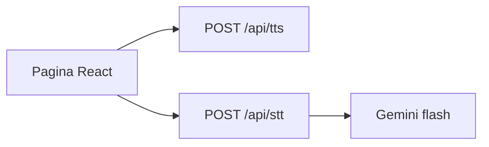

# email-to-podcast

Serviço TypeScript na Vercel Hobby: ouvir texto, transcrever recados curtos e, depois, a pasta Outlook **Feed** como podcast RSS. Este repositório é o código público. A instância com a caixa pessoal não entra no portfólio.

## Etapas 1 e 2 — texto ↔ áudio

Cola um texto na página, o servidor gera um MP3 com voz pt-BR (Microsoft Edge TTS) e você baixa o arquivo. No outro painel, envia um áudio curto (arquivo ou gravação) e vê a transcrição. Autenticação: header `Authorization: Bearer` com `APP_SECRET`.

A transcrição chama o Gemini (`gemini-2.5-flash`) na faixa gratuita do AI Studio. Clipes longos ou qualidade tipo Whisper `small` no PC **não** são o alvo Hobby: o limite é recado curto (3 minutos, 8 MB).

Fora destas etapas: Outlook, Blob, RSS.

## Como rodar local

1. Copie `.env.example` para `.env` e preencha `APP_SECRET` (qualquer string longa) e `GEMINI_API_KEY` ([AI Studio](https://aistudio.google.com/apikey), faixa gratuita com conta Google).
2. `npm install`
3. `npm run dev` — UI em `http://localhost:5173`, API em `http://127.0.0.1:3001`.

A senha na página é o mesmo `APP_SECRET`. Ela fica só no `sessionStorage`, não no bundle.

No deploy, `APP_SECRET` e `GEMINI_API_KEY` só no painel Vercel (Production e Preview). Não prefixe com `VITE_`.

## Deploy (Hobby, projeto separado)

Instância: [email-to-podcast.dan-figueiredo.dev.br](https://email-to-podcast.dan-figueiredo.dev.br). Projeto Vercel **à parte** do portfólio.

## O que não vai para o Git

`APP_SECRET`, `GEMINI_API_KEY`, tokens Microsoft, token do RSS, connection string do Blob, prints da pasta Feed. Se vazar no histórico, rotacionar.

Mesmo com o código aberto, `/api/tts` e `/api/stt` continuam com segredo. Sem isso o Hobby vira TTS/STT grátis para o mundo.

## Licença

MIT. A síntese usa [`msedge-tts`](https://www.npmjs.com/package/msedge-tts) (MIT), não o pacote AGPL `edge-tts-universal`. A transcrição usa a [Gemini API](https://ai.google.dev/gemini-api/docs/audio) (`gemini-2.5-flash`).

Áudio e texto passam por Vercel, pelo serviço de voz da Microsoft e pelo Gemini. Na faixa gratuita o Google pode usar o conteúdo para melhorar os produtos. Não é um produto para terceiros.
