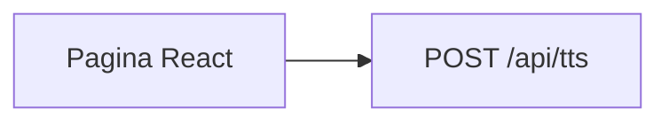

# email-to-podcast

Serviço TypeScript na Vercel Hobby: ouvir texto (e, depois, a pasta Outlook **Feed** como podcast RSS). Este repositório é o código público. A instância com a caixa pessoal não entra no portfólio.

## Etapa 1 — texto vira áudio

Cola um texto na página, o servidor gera um MP3 com voz pt-BR (Microsoft Edge TTS) e você baixa o arquivo. Autenticação: header `Authorization: Bearer` com `APP_SECRET`.

A etapa 2 (áudio → texto) reusa a mesma URL. Por isso o frontend é Vite + React, não uma página estática avulsa.

Fora desta etapa: Outlook, Blob, RSS, STT.

## Como rodar local

1. Copie `.env.example` para `.env` e preencha `APP_SECRET` (qualquer string longa).
2. `npm install`
3. `npm run dev` — UI em `http://localhost:5173`, API em `http://127.0.0.1:3001`.

A senha na página é o mesmo `APP_SECRET`. Ela fica só no `sessionStorage`, não no bundle.

## Deploy (Hobby, projeto separado)

Instância: [email-to-podcast.dan-figueiredo.dev.br](https://email-to-podcast.dan-figueiredo.dev.br). Projeto Vercel **à parte** do portfólio. `APP_SECRET` só no painel (Production e Preview). Não prefixe com `VITE_`.

## O que não vai para o Git

`APP_SECRET`, tokens Microsoft, token do RSS, connection string do Blob, prints da pasta Feed. Se vazar no histórico, rotacionar.

Mesmo com o código aberto, `/api/tts` continua com segredo. Sem isso o Hobby vira TTS grátis para o mundo.

## Licença

MIT. A síntese usa [`msedge-tts`](https://www.npmjs.com/package/msedge-tts) (MIT), não o pacote AGPL `edge-tts-universal`.

Áudio e texto passam por Vercel e pelo serviço de voz da Microsoft. Não é um produto para terceiros.
